# Class Diagram - Moneygement System

## Mermaid Class Diagram

```mermaid
classDiagram
    direction TB

    %% ==========================================
    %% ENTITY CLASSES (Models)
    %% ==========================================

    class User {
        -int id
        -string name
        -string email
        -string password
        -string currency
        -string avatar
        -string avatar_type
        -datetime email_verified_at
        -string remember_token
        -datetime created_at
        -datetime updated_at
        +transactions() HasMany~Transaction~
        +budgets() HasMany~Budget~
        +getBalanceAttribute() float
        +getSymbolAttribute() string
        +formatCurrency(value) string
    }

    class Transaction {
        -int id
        -int user_id
        -int category_id
        -decimal amount
        -enum type
        -string description
        -datetime transaction_date
        -datetime created_at
        -datetime updated_at
        +user() BelongsTo~User~
        +category() BelongsTo~Category~
    }

    class Category {
        -int id
        -int user_id
        -string name
        -enum type
        -datetime created_at
        -datetime updated_at
        +transactions() HasMany~Transaction~
        +budgets() HasMany~Budget~
    }

    class Budget {
        -int id
        -int user_id
        -int category_id
        -decimal amount
        -enum period
        -date start_date
        -date end_date
        -datetime created_at
        -datetime updated_at
        +user() BelongsTo~User~
        +category() BelongsTo~Category~
    }

    %% ==========================================
    %% CONTROLLER CLASSES
    %% ==========================================

    class Controller {
        <<abstract>>
    }

    class DashboardController {
        +index() View
    }

    class TransactionController {
        +index() View
        +create() Redirect
        +store(Request) Redirect
        +update(Request, Transaction) Redirect
        +destroy(Transaction) Redirect
        +deleteAll() Redirect
    }

    class BudgetController {
        +index() View
        +store(Request) Redirect
        +update(Request, id) Redirect
        +destroy(Budget) Redirect
    }

    class CategoryController {
        +index() View
        +store(Request) Redirect
    }

    class AiController {
        -getGeminiApiKey() string
        -callGemini(prompt, imageBase64, mimeType) string
        +chat(Request) JsonResponse
        +getInsight() JsonResponse
        +scanReceipt(Request) JsonResponse
        +storeReceipt(Request) Redirect
    }

    class ProfileController {
        +edit() View
        +update(Request) Redirect
        +destroy(Request) Redirect
    }

    %% ==========================================
    %% AUTH CONTROLLER CLASSES
    %% ==========================================

    class AuthenticatedSessionController {
        +create() View
        +store(LoginRequest) Redirect
        +destroy(Request) Redirect
    }

    class RegisteredUserController {
        +create() View
        +store(Request) Redirect
    }

    class VerifyEmailController {
        +__invoke(EmailVerificationRequest) Redirect
    }

    class EmailVerificationPromptController {
        +__invoke(Request) View
    }

    class EmailVerificationNotificationController {
        +store(Request) Redirect
    }

    class PasswordResetLinkController {
        +create() View
        +store(Request) Redirect
    }

    class NewPasswordController {
        +create(Request) View
        +store(Request) Redirect
    }

    class PasswordController {
        +update(Request) Redirect
    }

    class ConfirmablePasswordController {
        +show() View
        +store(Request) Redirect
    }

    %% ==========================================
    %% RELATIONSHIPS
    %% ==========================================

    %% Entity Relationships
    User "1" --o "*" Transaction : has
    User "1" --o "*" Budget : has
    Category "1" --o "*" Transaction : categorizes
    Category "1" --o "*" Budget : categorizes

    %% Controller Inheritance
    Controller <|-- DashboardController
    Controller <|-- TransactionController
    Controller <|-- BudgetController
    Controller <|-- CategoryController
    Controller <|-- AiController
    Controller <|-- ProfileController
    Controller <|-- AuthenticatedSessionController
    Controller <|-- RegisteredUserController
    Controller <|-- VerifyEmailController
    Controller <|-- EmailVerificationPromptController
    Controller <|-- EmailVerificationNotificationController
    Controller <|-- PasswordResetLinkController
    Controller <|-- NewPasswordController
    Controller <|-- PasswordController
    Controller <|-- ConfirmablePasswordController

    %% Controller-Model Dependencies
    DashboardController ..> User : uses
    DashboardController ..> Transaction : uses
    DashboardController ..> Budget : uses
    TransactionController ..> Transaction : manages
    TransactionController ..> Category : uses
    BudgetController ..> Budget : manages
    BudgetController ..> Category : uses
    CategoryController ..> Category : manages
    AiController ..> Transaction : uses
    ProfileController ..> User : manages
```

## Penjelasan Diagram

### 1. Entity Classes (Models)

| Class | Deskripsi |
|-------|-----------|
| **User** | Entitas pengguna dengan autentikasi, preferences (currency, avatar), dan computed properties (balance, symbol) |
| **Transaction** | Entitas transaksi keuangan dengan tipe income/expense |
| **Category** | Kategori transaksi dan budget (bisa global atau per-user) |
| **Budget** | Alokasi anggaran per kategori dengan periode weekly/monthly |

### 2. Entity Relationships

| Relationship | Tipe | Deskripsi |
|--------------|------|-----------|
| User → Transaction | 1:N | User memiliki banyak transaksi |
| User → Budget | 1:N | User memiliki banyak budget |
| Category → Transaction | 1:N | Kategori memiliki banyak transaksi |
| Category → Budget | 1:N | Kategori memiliki banyak budget |

### 3. Controller Classes

| Controller | Fungsi |
|------------|--------|
| **DashboardController** | Menampilkan dashboard dengan statistik keuangan |
| **TransactionController** | CRUD transaksi income/expense |
| **BudgetController** | CRUD budget per kategori |
| **CategoryController** | Mengelola kategori |
| **AiController** | Integrasi Gemini AI (chat, insight, OCR) |
| **ProfileController** | Manajemen profil user |

### 4. Auth Controllers

| Controller | Fungsi |
|------------|--------|
| **AuthenticatedSessionController** | Login/Logout |
| **RegisteredUserController** | Registrasi user baru |
| **VerifyEmailController** | Verifikasi email |
| **PasswordResetLinkController** | Request reset password |
| **NewPasswordController** | Set password baru |
| **PasswordController** | Update password |
| **ConfirmablePasswordController** | Konfirmasi password untuk aksi sensitif |

---

## Cara Menggunakan

Copy kode Mermaid di atas dan paste ke:
1. [Mermaid Live Editor](https://mermaid.live/)
2. GitHub README (support Mermaid native)
3. VS Code dengan extension Mermaid

---

*Generated: 23 Januari 2026*
